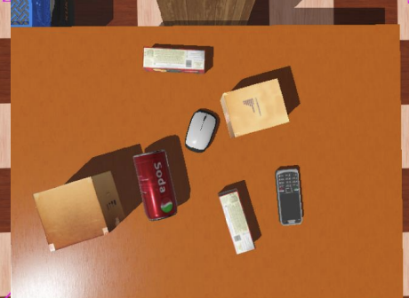
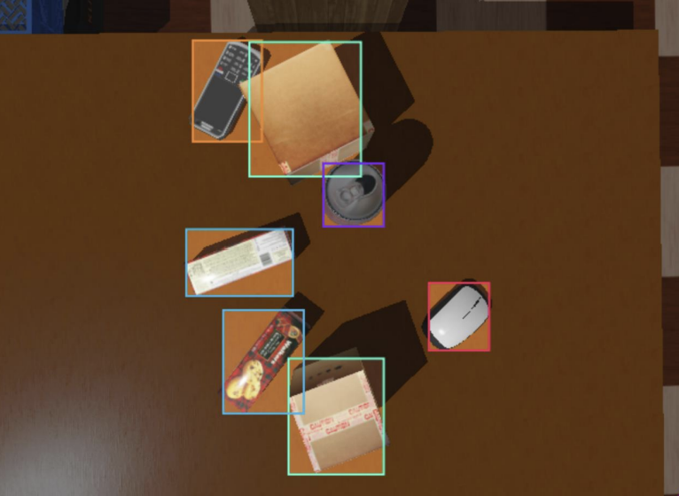

# UR5e Object Sorting Robot in Webots

## 1. Project Overview
This project simulates a **UR5e robot** in the **Webots** environment. The robot is positioned in front of a table with various objects such as a **mobile, biscuit box, soda can, mouse, and box**. Using a **camera mounted on its end-effector**, the robot identifies, picks up, and sorts objects into different baskets based on their category.

## 2. Key Features
- **Object Detection**: Uses a **Convolutional Neural Network (CNN)** to identify objects from the camera feed.
- **Localization**: Determines the **x, y, z** coordinates of each object based on the center pixel of the detected object.
- **Inverse Kinematics**: Computes the joint angles for the UR5e robot to reach the object's position.
- **Suction Gripper**: Uses a gripper to pick up objects and place them into the appropriate basket.

## 3. How It Works
1. **Image Capture**: The camera captures an image of the objects on the table.
2. **Object Detection**: The image is processed using a **CNN model** to detect objects.
3. **Localization**: Using the detected object's center pixel, the **real-world coordinates** (**x, y, z**) are calculated.
4. **IK Calculation**: The robot's **inverse kinematics** is calculated to find the angles required to reach the object's position.
5. **Object Pickup and Placement**:
   - The robot moves to the object's position.
   - The **suction gripper** is activated to pick up the object.
   - The object is moved to the appropriate basket and released.

## 4. Project Structure
- **/data**: Contains training images and labels.
- **/models**: Pre-trained CNN models used for object detection.
- **/src**: Python scripts for:
  - **Object detection using CNN**
  - **Inverse Kinematics calculations**
  - **Robot control scripts in Webots**
- **/simulation**: Webots simulation files.
- **README.md**: Documentation of the project.

## 5. Dataset
- **Training Set**: 465 images.
- **Validation Set**: 44 images.
- **Image Size**: All images were resized to **640x640** pixels before being processed by the CNN.

## 6. Example Images
### a. Table Setup with Objects


*This image shows the UR5e robot positioned in front of a table with various objects.*

### b. CNN Object Detection


*This image demonstrates the CNN's detection capabilities, with detected objects highlighted by bounding boxes.*

*To include these images in your repository, place them in an `images` folder and update the paths accordingly.*

## 7. Requirements
- **Webots R2024a**
- **Python 3.8+**
- Libraries:
  - `torch`
  - `torchvision`
  - `numpy`
  - `opencv-python`
  - `webots_ros`
- **Roboflow** account for dataset management.

## 8. Setup Instructions
1. **Clone the repository**:
   ```bash
   git clone https://github.com/yourusername/ur5e-object-sorting.git
   cd ur5e-object-sorting
